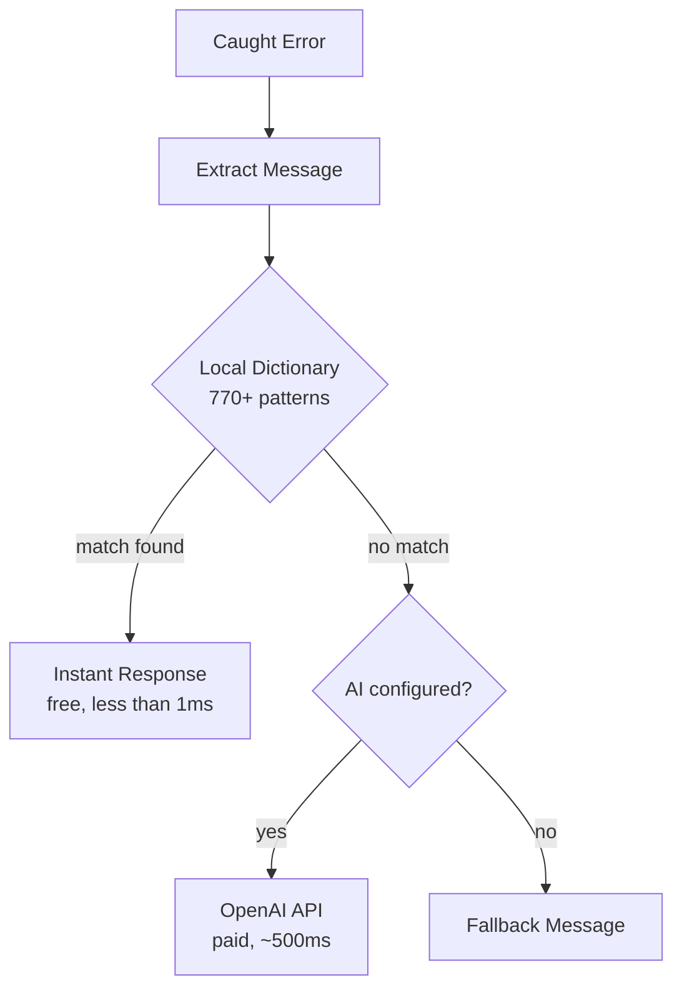

# web3-error-humanizer

> A local-first developer toolkit for Web3 errors -- structured classification, severity, actionable suggestions, and 770+ local patterns. Optional AI fallback.

[](https://www.npmjs.com/package/web3-error-humanizer)
[](https://opensource.org/licenses/MIT)
[](https://www.typescriptlang.org/)

## Why?

When a DEX swap fails, your users see this:

```
execution reverted: INSUFFICIENT_OUTPUT_AMOUNT
```

```
Error: Pancake: K
```

```
ContractFunctionRevertedError: UniswapV2: LOCKED
```

With this library, they see this instead:

```
Price moved too much. Try increasing your slippage tolerance.
```

```
Low liquidity for this pair. Try a smaller swap amount.
```

```
This pair is currently locked. Try again shortly.
```

**One import. Zero config. No API key required.**

```typescript
import { humanizeError } from "web3-error-humanizer";

const message = humanizeError(error);
// "Price moved too much. Try increasing your slippage tolerance."
```

Or get **full structured output** for building smart UIs:

```typescript
import {
  humanizeErrorDetailed,
  isRecoverable,
  classifyError,
} from "web3-error-humanizer";

const result = humanizeErrorDetailed(error);
// {
//   message:     "Price moved too much. Try increasing your slippage tolerance.",
//   category:    "slippage",
//   severity:    "warning",
//   suggestion:  "Increase your slippage tolerance or try a smaller amount.",
//   recoverable: true,
//   source:      "local",
//   matchedKey:  "INSUFFICIENT_OUTPUT_AMOUNT",
//   rawMessage:  "INSUFFICIENT_OUTPUT_AMOUNT"
// }

if (result.category === "insufficient_allowance") showApproveButton();
if (result.recoverable) showRetryButton();
```

## Why Developers Like It

- **Useful without AI** -- the default import is local-only, fast, and has zero runtime dependencies
- **Structured, not just pretty strings** -- categories, severity, suggestions, and recoverability let you build real product UX
- **Optional AI instead of forced AI** -- unknown errors can use the `/ai` entry point, but the core package never requires an API key
- **Safe to bundle** -- ESM + CommonJS exports, TypeScript types, and source maps in the published build

## Features

- **770+ local error patterns** -- Most errors matched instantly without API calls (O(1) exact matches)
- **Structured error output** -- Category, severity, suggestion, and recoverability for every error
- **16 error categories** -- `user_rejection`, `insufficient_funds`, `slippage`, `gas`, `network`, `bridge`, and more
- **Zero dependencies** -- The main entry point has no runtime dependencies at all
- **AI fallback** -- Unknown errors optionally analyzed by GPT-4o-mini (separate import)
- **viem-compatible** -- Deep error extraction for nested blockchain errors (viem is optional)
- **Extensible** -- Add your own error patterns with `addPattern()` / `addPatterns()`
- **Dual module support** -- Works with both ESM (`import`) and CommonJS (`require`)
- **TypeScript ready** -- Full type definitions included

## Supported Protocols

| Protocol                           | Errors Covered                                                             |
| ---------------------------------- | -------------------------------------------------------------------------- |
| **Uniswap V2/V3/V4**               | K, INSUFFICIENT_OUTPUT_AMOUNT, EXPIRED, LOCKED, SPL, Hook errors, and more |
| **PancakeSwap**                    | K, INSUFFICIENT_LIQUIDITY, TRANSFER_FAILED, etc.                           |
| **SushiSwap**                      | K, INSUFFICIENT_OUTPUT_AMOUNT, EXPIRED                                     |
| **Curve Finance**                  | Insufficient output/input, slippage, math errors                           |
| **Balancer**                       | Insufficient liquidity, paused pools, swap disabled                        |
| **1inch**                          | minReturn, ReturnAmountIsNotEnough, insufficient liquidity                 |
| **DODO**                           | Insufficient output/input, liquidity errors                                |
| **KyberSwap**                      | Insufficient output/input, liquidity errors                                |
| **Aave V3**                        | VL\_\* errors (borrowing, supply caps, health factors)                     |
| **Account Abstraction (ERC-4337)** | AA10-AA51 (EntryPoint errors, paymaster, validation)                       |
| **Solana / Jupiter**               | Program errors, slippage, compute budget, blockhash                        |
| **LayerZero**                      | Bridge errors, token unavailability, message blocking                      |
| **Li.Fi / Stargate**               | Route errors, slippage, amount limits                                      |
| **Arbitrum / Optimism**            | Retryable tickets, L2 execution, fee errors                                |
| **MetaMask/EIP-1193**              | 4001, 4100, 4900, -32603, and all standard codes                           |
| **WalletConnect/Reown**            | USER_REJECTED, SESSION_EXPIRED, APKT001-APKT010                            |
| **Gnosis Safe**                    | GS000-GS031 (initialization, signatures, owners)                           |
| **ERC20/721/1155**                 | ERC-6093 standard errors, allowance, balance, transfer                     |
| **Gas/Network**                    | Underpriced, out of gas, timeout, replacement errors                       |
| **Hardware Wallets**               | Ledger, Trezor connection and signing errors                               |
| **Multi-chain Wallets**            | Phantom, TronLink, Sui, Aptos, TON, Bitcoin wallets                        |

## Installation

```bash
npm install web3-error-humanizer
```

```bash
pnpm add web3-error-humanizer
```

```bash
yarn add web3-error-humanizer
```

> **Note:** The main entry point has zero dependencies. If you want AI fallback, install `openai` as well. If your app uses viem, the library will automatically detect and extract viem error details. The package supports Node.js `>=18`.

## Quick Start

### Option 1: Local Only (No API Key Required)

```typescript
import { humanizeError } from "web3-error-humanizer";

try {
  await contract.write.swap([...]);
} catch (error) {
  const message = humanizeError(error);
  console.log(message);
  // "Price moved too much. Try increasing your slippage tolerance."
}
```

**Zero cost, instant response, 770+ error patterns covered.**

### Option 2: With AI Fallback

```typescript
import { Web3ErrorHumanizer } from "web3-error-humanizer/ai";

const humanizer = new Web3ErrorHumanizer({
  openaiApiKey: process.env.OPENAI_API_KEY!,
});

try {
  await contract.write.swap([...]);
} catch (error) {
  const message = await humanizer.humanize(error);
  console.log(message);
  // Local match -> instant response
  // Unknown error -> AI generates response
}
```

> Requires `openai` as a peer dependency: `npm install openai`
>
> Privacy note: the `/ai` entry point only sends sanitized error text and optional context to OpenAI when you configure an API key. The default import never makes network requests.

## Toolkit API -- Structured Error Output

The toolkit API gives you programmatic control over your error UX -- not just display strings.

### Error Categories

Every matched error is classified into one of 16 categories:

| Category                 | Description                       | Severity  | Recoverable |
| ------------------------ | --------------------------------- | --------- | ----------- |
| `user_rejection`         | User cancelled/rejected in wallet | `info`    | Yes         |
| `insufficient_funds`     | Not enough balance or gas         | `error`   | Yes         |
| `insufficient_allowance` | Token needs approval first        | `warning` | Yes         |
| `slippage`               | Price moved beyond tolerance      | `warning` | Yes         |
| `liquidity`              | Pool has no/low liquidity         | `error`   | Yes         |
| `gas`                    | Gas estimation or pricing failed  | `error`   | Yes         |
| `nonce`                  | Transaction ordering issue        | `warning` | Yes         |
| `network`                | RPC / connection problems         | `error`   | Yes         |
| `contract_error`         | Smart contract reverted           | `error`   | No          |
| `timeout`                | Transaction/request timed out     | `warning` | Yes         |
| `wallet_connection`      | Wallet not connected/locked       | `error`   | Yes         |
| `chain_mismatch`         | Wrong network selected            | `warning` | Yes         |
| `protocol_limit`         | Supply/borrow caps, paused state  | `error`   | Yes         |
| `signature`              | Signing failed                    | `error`   | Yes         |
| `bridge`                 | Cross-chain bridge errors         | `error`   | Yes         |
| `unknown`                | Unrecognized error                | `error`   | No          |

### Building Smart Error UIs

```typescript
import {
  humanizeErrorDetailed,
  classifyError,
  isRecoverable,
  getSuggestion,
} from "web3-error-humanizer";

try {
  await sendTransaction();
} catch (err) {
  const result = humanizeErrorDetailed(err);

  // Display the message
  showToast(result.message);

  // Branch UI based on category
  if (result.category === "insufficient_allowance") {
    showApproveButton();
  } else if (result.category === "chain_mismatch") {
    showSwitchNetworkButton();
  } else if (result.category === "insufficient_funds") {
    showAddFundsLink();
  } else if (result.recoverable) {
    showRetryButton();
  }

  // Log structured analytics
  analytics.track("tx_error", {
    category: result.category,
    severity: result.severity,
    recoverable: result.recoverable,
    raw: result.rawMessage,
  });
}
```

### Quick Classification (No Humanization)

```typescript
import {
  classifyError,
  isRecoverable,
  getSuggestion,
  getErrorSeverity,
} from "web3-error-humanizer";

const category = classifyError(error); // "slippage"
const canRetry = isRecoverable(error); // true
const nextStep = getSuggestion(error); // "Increase your slippage tolerance or try a smaller amount."
const severity = getErrorSeverity(error); // "warning"
```

## Usage with Context

Provide swap context for smarter AI responses:

```typescript
const message = await humanizer.humanize(error, {
  fromToken: "USDC",
  toToken: "PEPE",
  amount: "1000",
  slippage: "0.5%",
  network: "Ethereum",
});
// "PEPE's price is changing rapidly. Increase slippage to 1-2% or try a smaller amount."
```

## API Reference

### Standalone Functions (No API Key Required)

Import from `web3-error-humanizer` (zero dependencies).

#### `humanizeError(error, fallback?)`

Humanize an error using only the local dictionary. Always returns a string.

```typescript
import { humanizeError } from "web3-error-humanizer";

const message = humanizeError(error);
// Returns human message or "Transaction failed. Please try again."

const message = humanizeError(error, "Custom fallback");
// Returns human message or "Custom fallback"
```

#### `humanizeErrorLocal(error)`

Same as above but returns `null` if no local match found.

```typescript
import { humanizeErrorLocal } from "web3-error-humanizer";

const message = humanizeErrorLocal(error);
if (message) {
  showError(message);
} else {
  // Handle unknown error your way
}
```

#### `humanizeErrorDetailed(error, fallback?)`

Local-only humanization that returns a rich `HumanizedResult` object:

```typescript
import { humanizeErrorDetailed } from "web3-error-humanizer";

const result = humanizeErrorDetailed(error);
// {
//   message:     "Price moved too much. Try increasing your slippage tolerance.",
//   category:    "slippage",
//   severity:    "warning",
//   suggestion:  "Increase your slippage tolerance or try a smaller amount.",
//   recoverable: true,
//   source:      "local",
//   matchedKey:  "INSUFFICIENT_OUTPUT_AMOUNT",
//   rawMessage:  "INSUFFICIENT_OUTPUT_AMOUNT"
// }
```

#### `classifyError(error)`

Returns the `ErrorCategory` for an error without humanizing it. Returns `"unknown"` if no match.

```typescript
import { classifyError } from "web3-error-humanizer";

classifyError(new Error("INSUFFICIENT_FUNDS")); // "insufficient_funds"
classifyError(new Error("ACTION_REJECTED")); // "user_rejection"
classifyError({ code: 4001, message: "..." }); // "user_rejection"
```

#### `isRecoverable(error)` / `getSuggestion(error)` / `getErrorSeverity(error)`

```typescript
import {
  isRecoverable,
  getSuggestion,
  getErrorSeverity,
} from "web3-error-humanizer";

isRecoverable(new Error("out of gas")); // true
isRecoverable(new Error("execution reverted")); // false

getSuggestion(new Error("INSUFFICIENT_FUNDS"));
// "Add more funds to your wallet and try again."

getErrorSeverity(new Error("ACTION_REJECTED")); // "info"
getErrorSeverity(new Error("NETWORK_ERROR")); // "error"
```

#### `extractRawMessage(error)`

Extracts the raw error message from any error object (Error, ethers, viem, plain object, etc.).

```typescript
import { extractRawMessage } from "web3-error-humanizer";

extractRawMessage(new Error("out of gas")); // "out of gas"
extractRawMessage({ reason: "INSUFFICIENT_FUNDS" }); // "INSUFFICIENT_FUNDS"
extractRawMessage(null); // "Unknown error"
```

#### `addPattern(key, message, category?)` / `addPatterns(map)`

Add custom error patterns at runtime. Optionally specify a category for structured classification.

Custom patterns are **process-wide**. If you add them in tests, call `resetCustomPatterns()` between cases.

```typescript
import { addPattern, addPatterns } from "web3-error-humanizer";

// Simple (defaults to "unknown" category)
addPattern("CUSTOM_DEX_ERROR", "Your custom message here.");

// With category
addPattern("MY_SLIPPAGE_ERROR", "Price moved.", "slippage");

// Batch add (string values default to "unknown" category)
addPatterns({
  "MyProtocol: SLIPPAGE": "Price moved. Increase slippage.",
  "MyProtocol: LOCKED": "Pool is locked. Try again later.",
});

// Batch add with categories
addPatterns({
  "MyProtocol: SLIPPAGE": { message: "Price moved.", category: "slippage" },
  "MyProtocol: PAUSED": { message: "Pool paused.", category: "protocol_limit" },
});
```

Normalized duplicate keys are rejected so new custom patterns cannot silently shadow an existing built-in pattern.

#### `getLocalErrorCount()` / `hasLocalPattern(pattern)` / `getLocalPatterns()`

```typescript
import {
  getLocalErrorCount,
  hasLocalPattern,
  getLocalPatterns,
} from "web3-error-humanizer";

console.log(getLocalErrorCount()); // 770+
console.log(hasLocalPattern("INSUFFICIENT_FUNDS")); // true
console.log(getLocalPatterns()); // ["ACTION_REJECTED", "INSUFFICIENT_FUNDS", ...]
```

#### `resetCustomPatterns()` / `BUILTIN_LOCAL_ERROR_MAP` / `BUILTIN_CATEGORIZED_PATTERNS`

Use these helpers if you want to inspect the shipped dictionary or reset runtime mutations:

```typescript
import {
  BUILTIN_LOCAL_ERROR_MAP,
  BUILTIN_CATEGORIZED_PATTERNS,
  addPattern,
  resetCustomPatterns,
} from "web3-error-humanizer";

console.log(BUILTIN_LOCAL_ERROR_MAP["INSUFFICIENT_FUNDS"]);
console.log(BUILTIN_CATEGORIZED_PATTERNS["INSUFFICIENT_FUNDS"].category);

addPattern("MY_TEMP_ERROR", "Temporary message.");
resetCustomPatterns(); // removes custom additions and restores built-ins
```

### Class-based API (Optional AI Fallback)

Import from `web3-error-humanizer/ai`. Requires `openai` as a peer dependency.

#### `new Web3ErrorHumanizer(config?)`

Creates a new humanizer instance. Config is optional.

| Parameter                | Type     | Required | Description                           |
| ------------------------ | -------- | -------- | ------------------------------------- |
| `config.openaiApiKey`    | `string` | **No**   | OpenAI API key (enables AI fallback)  |
| `config.aiModel`         | `string` | No       | Model to use (default: `gpt-4o-mini`) |
| `config.fallbackMessage` | `string` | No       | Message when no local match and no AI |

```typescript
import { Web3ErrorHumanizer } from "web3-error-humanizer/ai";

// Local only - no API key needed
const humanizer = new Web3ErrorHumanizer();

// With AI fallback
const humanizer = new Web3ErrorHumanizer({
  openaiApiKey: process.env.OPENAI_API_KEY,
});

console.log(humanizer.hasAI); // true or false
```

#### `humanizer.humanize(error, context?)`

Translates a Web3 error into a human-readable message.

| Parameter | Type          | Description                                        |
| --------- | ------------- | -------------------------------------------------- |
| `error`   | `unknown`     | The caught error object (viem, ethers, or generic) |
| `context` | `SwapContext` | Optional swap details for smarter AI responses     |

**Returns:** `Promise<string>` -- The human-friendly error message.

#### `humanizer.humanizeDetailed(error, context?)`

Returns a full `HumanizedResult` including `message`, `category`, `severity`, `suggestion`, `recoverable`, `source`, `matchedKey`, and `rawMessage`. Uses local dictionary first, then AI (if configured), otherwise the fallback message.

### Types

#### `HumanizedResult`

```typescript
interface HumanizedResult {
  message: string; // Human-friendly error message
  category: ErrorCategory; // e.g. "slippage", "gas", "user_rejection"
  severity: ErrorSeverity; // "error" | "warning" | "info"
  suggestion: string; // Actionable next step for the user
  recoverable: boolean; // Can the user take action to fix this?
  source: HumanizeSource; // "local" | "ai" | "fallback"
  matchedKey?: string; // The matched pattern key (when source === "local")
  rawMessage: string; // The extracted raw error message
}
```

#### `ErrorCategory`

```typescript
type ErrorCategory =
  | "user_rejection"
  | "insufficient_funds"
  | "insufficient_allowance"
  | "slippage"
  | "liquidity"
  | "gas"
  | "nonce"
  | "network"
  | "contract_error"
  | "timeout"
  | "wallet_connection"
  | "chain_mismatch"
  | "protocol_limit"
  | "signature"
  | "bridge"
  | "unknown";
```

#### `SwapContext`

```typescript
interface SwapContext {
  fromToken?: string; // Token being sold
  toToken?: string; // Token being bought
  amount?: string; // Amount being swapped
  slippage?: string; // Slippage tolerance (e.g., "0.5%")
  network?: string; // Network name (e.g., "Ethereum", "BSC")
}
```

## How It Works



1. **Extract** -- Pulls the raw error message from viem `BaseError`, ethers error objects, EIP-1193 codes, or plain strings
2. **Match locally** -- O(1) exact lookup via `Map`, then substring matching sorted by specificity
3. **AI fallback** -- If no local match and OpenAI is configured, generates a user-friendly explanation
4. **Fallback** -- Returns a configurable default message if nothing else matches

## Supported Error Categories

### User Actions / Wallet Rejections

| Error Pattern     | Human Message                                 |
| ----------------- | --------------------------------------------- |
| `ACTION_REJECTED` | The transaction was cancelled in your wallet. |
| `USER_REJECTED`   | You declined the request in your wallet.      |
| `4001`            | You declined the request in your wallet.      |

### Insufficient Funds / Balance

| Error Pattern          | Human Message                                          |
| ---------------------- | ------------------------------------------------------ |
| `INSUFFICIENT_FUNDS`   | You don't have enough gas to pay for this transaction. |
| `insufficient balance` | Your token balance is too low for this swap.           |
| `exceeds balance`      | The amount exceeds your available balance.             |

### Slippage / Price Impact

| Error Pattern                | Human Message                                                 |
| ---------------------------- | ------------------------------------------------------------- |
| `INSUFFICIENT_OUTPUT_AMOUNT` | Price moved too much. Try increasing your slippage tolerance. |
| `Too little received`        | Price changed too much. Increase your slippage tolerance.     |
| `INSUFFICIENT_LIQUIDITY`     | Not enough liquidity for this trade. Try a smaller amount.    |

### DEX-Specific (Uniswap, PancakeSwap, SushiSwap)

| Error Pattern              | Human Message                                           |
| -------------------------- | ------------------------------------------------------- |
| `UniswapV2: K`             | Low liquidity for this pair. Try a smaller swap amount. |
| `Pancake: K`               | Low liquidity for this pair. Try a smaller swap amount. |
| `UniswapV2: LOCKED`        | This pair is currently locked. Try again shortly.       |
| `UniswapV2Router: EXPIRED` | Transaction expired. Please try again.                  |

### Token Approval

| Error Pattern                   | Human Message                                        |
| ------------------------------- | ---------------------------------------------------- |
| `insufficient allowance`        | You need to approve the token first before swapping. |
| `ERC20: insufficient allowance` | Please approve the token before swapping.            |
| `TRANSFER_FROM_FAILED`          | Token approval failed or insufficient balance.       |

### Gas / Network

| Error Pattern                         | Human Message                                             |
| ------------------------------------- | --------------------------------------------------------- |
| `out of gas`                          | Transaction ran out of gas. Try increasing the gas limit. |
| `replacement transaction underpriced` | Gas price too low to replace pending transaction.         |
| `TIMEOUT`                             | Request timed out. Please check your connection.          |
| `NETWORK_ERROR`                       | Network connection issue. Please check your internet.     |

### RPC Error Codes (EIP-1193)

| Code     | Human Message                                              |
| -------- | ---------------------------------------------------------- |
| `4001`   | You declined the request in your wallet.                   |
| `4900`   | Wallet is disconnected. Please reconnect.                  |
| `4901`   | Wallet is connected to a different network. Please switch. |
| `-32603` | Internal error. Please try again.                          |

### Account Abstraction (ERC-4337)

| Error Code | Human Message                                                          |
| ---------- | ---------------------------------------------------------------------- |
| `AA10`     | Account already exists. You cannot initialize it again.                |
| `AA21`     | You don't have enough native tokens to pay for this transaction's gas. |
| `AA23`     | Transaction validation failed. Signature is wrong or gas is too low.   |
| `AA31`     | The gas sponsor (Paymaster) has run out of funds. Try again later.     |

### Uniswap V4 / Hooks

| Error Pattern    | Human Message                                                              |
| ---------------- | -------------------------------------------------------------------------- |
| `UniswapV4: LOK` | The pool is locked. A hook might be preventing re-entry.                   |
| `UniswapV4: SPL` | Price limit reached. The trade would move the price too far.               |
| `HookReverted`   | A custom logic 'hook' attached to this pool failed. Try a different route. |
| `FeeTooHigh`     | The dynamic fee set by the pool's hook is too high for this trade.         |

### Uniswap V4 Custom Errors (NEW)

| Error Pattern            | Human Message                                                  |
| ------------------------ | -------------------------------------------------------------- |
| `CurrencyNotSettled`     | Token balances were not settled after the swap.                |
| `PoolNotInitialized`     | This pool has not been initialized yet.                        |
| `SwapAmountCannotBeZero` | The swap amount cannot be zero.                                |
| `HookAddressNotValid`    | The hook address does not match the required permission flags. |
| `FailedHookCall`         | The call to the pool hook failed.                              |
| `InvalidTick`            | The specified tick value is invalid.                           |

### Compound V3 (Comet) Errors (NEW)

| Error Pattern       | Human Message                                                      |
| ------------------- | ------------------------------------------------------------------ |
| `BorrowTooSmall`    | Borrow amount is too small. The minimum borrow amount was not met. |
| `NotCollateralized` | Your position is not sufficiently collateralized.                  |
| `SupplyCapExceeded` | Supply cap exceeded for this asset.                                |
| `TooMuchSlippage`   | Too much slippage. The price moved beyond the acceptable range.    |
| `TransferInFailed`  | Token transfer into the protocol failed.                           |

### Aave V3 Numeric Error Codes (NEW)

| Code | Human Message                                                     |
| ---- | ----------------------------------------------------------------- |
| `27` | This reserve is currently inactive.                               |
| `28` | This reserve is frozen. You cannot perform this action right now. |
| `35` | Your health factor is too low. Add collateral or repay some debt. |
| `50` | Borrow cap exceeded for this reserve. Try a smaller amount.       |
| `51` | Supply cap exceeded for this reserve. Try a smaller deposit.      |
| `91` | Flash loans are disabled for this asset.                          |

### WalletConnect v2 Error Codes (NEW)

| Code   | Human Message                                                 |
| ------ | ------------------------------------------------------------- |
| `3001` | Unauthorized method. Your wallet doesn't support this action. |
| `5100` | The requested chain is not supported by this wallet.          |
| `7001` | No active session found. Please reconnect your wallet.        |
| `8000` | WalletConnect session request expired. Please try again.      |

### Solana Program Errors (NEW)

| Error Pattern                                | Human Message                                         |
| -------------------------------------------- | ----------------------------------------------------- |
| `SendTransactionError`                       | Failed to send the Solana transaction.                |
| `TransactionExpiredBlockheightExceededError` | Transaction expired because block height exceeded.    |
| `MissingRequiredSignature`                   | A required signature is missing from the transaction. |
| `AccountNotRentExempt`                       | Account does not have enough SOL to be rent-exempt.   |

### Solidity Panic Codes & Selectors (NEW)

| Error Pattern | Human Message                                               |
| ------------- | ----------------------------------------------------------- |
| `Panic(0x11)` | Arithmetic overflow or underflow.                           |
| `Panic(0x12)` | Division or modulo by zero.                                 |
| `Panic(0x32)` | Array index is out of bounds.                               |
| `0xe450d38c`  | Insufficient token balance (ERC-20).                        |
| `0xfb8f41b2`  | Insufficient token allowance (ERC-20).                      |
| `0x5212cba1`  | Token balances not settled (Uniswap V4 CurrencyNotSettled). |

### OpenZeppelin / Common Contract Errors (NEW)

| Error Pattern                      | Human Message                           |
| ---------------------------------- | --------------------------------------- |
| `OwnableUnauthorizedAccount`       | You are not the owner of this contract. |
| `EnforcedPause`                    | This contract is currently paused.      |
| `ReentrancyGuardReentrantCall`     | Re-entrant call detected and blocked.   |
| `AccessControlUnauthorizedAccount` | You do not have the required role.      |

### Bridge & Cross-Chain

| Error Pattern                   | Human Message                                                                |
| ------------------------------- | ---------------------------------------------------------------------------- |
| `LayerZero: LzTokenUnavailable` | The bridge does not have enough liquidity of this token right now.           |
| `NOT_PROCESSABLE_REFUND_NEEDED` | The bridge failed due to price movement. A refund has been triggered.        |
| `AMOUNT_TOO_LOW`                | The amount is too small to bridge. Please send more.                         |
| `retryable ticket expired`      | Arbitrum retryable expired. Re-send the transaction or re-create the ticket. |

## Framework Examples

### Next.js / React (Secure - Recommended)

**Security Note:** Never expose your OpenAI API key in the browser. Use a server-side API route:

**1. Create API Route (`app/api/humanize-error/route.ts`):**

```typescript
import { NextRequest, NextResponse } from "next/server";
import { Web3ErrorHumanizer } from "web3-error-humanizer/ai";

const humanizer = new Web3ErrorHumanizer({
  openaiApiKey: process.env.OPENAI_API_KEY!,
});

export async function POST(request: NextRequest) {
  const { errorMessage, context } = await request.json();
  const message = await humanizer.humanize(new Error(errorMessage), context);
  return NextResponse.json({ message });
}
```

**2. Create Client Helper:**

```typescript
// lib/humanize-error.ts
import { humanizeError } from "web3-error-humanizer";

export async function humanizeSwapError(error: unknown, context?: SwapContext) {
  // Try local match first (instant, no network)
  const localResult = humanizeError(error);
  if (localResult !== "Transaction failed. Please try again.") {
    return localResult;
  }

  // Fall back to AI via server
  const errorMessage = error instanceof Error ? error.message : String(error);
  const response = await fetch("/api/humanize-error", {
    method: "POST",
    headers: { "Content-Type": "application/json" },
    body: JSON.stringify({ errorMessage, context }),
  });

  const data = await response.json();
  return data.message;
}
```

**3. Use in Component:**

```tsx
"use client";
import { humanizeSwapError } from "@/lib/humanize-error";

export function SwapButton() {
  const handleSwap = async () => {
    try {
      await contract.write.swap([...]);
    } catch (err) {
      const message = await humanizeSwapError(err, {
        fromToken: "ETH",
        toToken: "USDC",
      });
      toast.error(message);
    }
  };
}
```

### Node.js Backend

```typescript
import { Web3ErrorHumanizer } from "web3-error-humanizer/ai";

const humanizer = new Web3ErrorHumanizer({
  openaiApiKey: process.env.OPENAI_API_KEY!,
  aiModel: "gpt-4-turbo",
});

app.post("/api/swap", async (req, res) => {
  try {
    const result = await executeSwap(req.body);
    res.json({ success: true, result });
  } catch (error) {
    const message = await humanizer.humanize(error, req.body);
    res.status(400).json({ success: false, message });
  }
});
```

### CommonJS

```javascript
const { humanizeError } = require("web3-error-humanizer");

// Or with AI:
// const { Web3ErrorHumanizer } = require("web3-error-humanizer/ai");
```

## Cost Optimization

The library is designed to minimize API costs:

1. **Local-first** -- 770+ error patterns never hit the API
2. **Performance optimized** -- O(1) exact matches using Map-based lookups
3. **Concise prompts** -- AI requests use minimal tokens (max 100 tokens)
4. **gpt-4o-mini default** -- Uses the most cost-effective model
5. **Retry logic** -- Automatic retry with exponential backoff for rate limits

For high-volume applications, consider:

- Adding more patterns with `addPattern()` / `addPatterns()`
- Caching AI responses for repeated errors (not included, but easy to add)
- Using a faster/cheaper model via `aiModel` config

## Performance

- **Exact matches**: O(1) using Map lookups
- **Substring matches**: O(n) in the number of substring patterns, optimized by specificity (longest first)
- **Error extraction**: Handles nested errors, error chains, and multiple formats
- **Normalization**: Unicode-aware with diacritic removal for better matching
- **Custom pattern rebuilds**: `addPattern()` / `addPatterns()` rebuild indexes once after mutation

## Error Coverage

The library covers errors from:

- **DEX Protocols**: Uniswap (V2/V3/V4), PancakeSwap, SushiSwap, Curve, Balancer, 1inch, DODO, KyberSwap
- **Lending**: Aave V3 (VL\_\* errors)
- **Account Abstraction**: ERC-4337 EntryPoint errors (AA10-AA51)
- **Bridges**: LayerZero, Li.Fi, Stargate, Arbitrum, Optimism
- **Wallets**: MetaMask, WalletConnect/Reown, Phantom, TronLink, Sui, Aptos, TON, Bitcoin wallets
- **Hardware**: Ledger, Trezor
- **Multi-sig**: Gnosis Safe (GS000-GS031)
- **Standards**: ERC-6093 custom errors, EIP-1193 RPC codes, Solidity panic codes
- **Solana**: Jupiter aggregator, Whirlpool, program errors, compute budget
- **Bitcoin**: UTXO errors, PSBT signing, transaction validation
- **Validation**: Input validation errors, parameter requirements, address validation
- **Additional RPC**: Extended RPC error codes (-32009 to -32015, -32612, -32613)

## Limitations

- Local matching is only as good as the current dictionary. Unknown protocol-specific errors still need new patterns or the optional AI path.
- Substring matching is intentionally conservative, but it can still be less precise than exact matches for very noisy provider messages.
- `addPattern()` and `addPatterns()` mutate a shared in-memory registry for the current process.
- If you use `web3-error-humanizer/ai`, do not pass secrets in error context that you would not want sent to your model provider.

## Contributing

See [CONTRIBUTING.md](CONTRIBUTING.md) for how to add error patterns and submit pull requests.

## License

MIT © [halilatilla](https://github.com/halilatilla)
