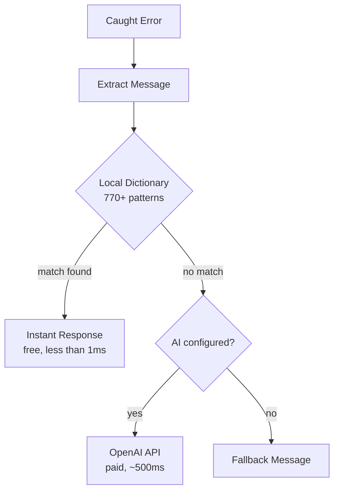

# web3-error-humanizer

> A local-first developer toolkit for Web3 errors -- structured classification, severity, actionable suggestions, and 770+ local patterns. Optional AI fallback.

[](https://www.npmjs.com/package/web3-error-humanizer)
[](https://opensource.org/licenses/MIT)
[](https://www.typescriptlang.org/)

## Why?

When a DEX swap fails, your users see this:

```
execution reverted: INSUFFICIENT_OUTPUT_AMOUNT
```

```
Error: Pancake: K
```

```
ContractFunctionRevertedError: UniswapV2: LOCKED
```

With this library, they see this instead:

```
Price moved too much. Try increasing your slippage tolerance.
```

```
Low liquidity for this pair. Try a smaller swap amount.
```

```
This pair is currently locked. Try again shortly.
```

**One import. Zero config. No API key required.**

```typescript
import { humanizeError } from "web3-error-humanizer";

const message = humanizeError(error);
// "Price moved too much. Try increasing your slippage tolerance."
```

Or get **full structured output** for building smart UIs:

```typescript
import {
  humanizeErrorDetailed,
  isRecoverable,
  classifyError,
} from "web3-error-humanizer";

const result = humanizeErrorDetailed(error);
// {
//   message:     "Price moved too much. Try increasing your slippage tolerance.",
//   category:    "slippage",
//   severity:    "warning",
//   suggestion:  "Increase your slippage tolerance or try a smaller amount.",
//   recoverable: true,
//   source:      "local",
//   matchedKey:  "INSUFFICIENT_OUTPUT_AMOUNT",
//   rawMessage:  "INSUFFICIENT_OUTPUT_AMOUNT"
// }

if (result.category === "insufficient_allowance") showApproveButton();
if (result.recoverable) showRetryButton();
```

## Why Developers Like It

- **Useful without AI** -- the default import is local-only, fast, and has zero runtime dependencies
- **Structured, not just pretty strings** -- categories, severity, suggestions, and recoverability let you build real product UX
- **Optional AI instead of forced AI** -- unknown errors can use the `/ai` entry point, but the core package never requires an API key
- **Safe to bundle** -- ESM + CommonJS exports, TypeScript types, and source maps in the published build

## Features

- **770+ local error patterns** -- O(1) exact matches, no API calls needed
- **Structured error output** -- category, severity, suggestion, and recoverability for every error
- **16 error categories** -- `user_rejection`, `insufficient_funds`, `slippage`, `gas`, `network`, `bridge`, and more
- **Zero dependencies** -- the main entry point has no runtime dependencies
- **AI fallback** -- unknown errors optionally analyzed by GPT-4o-mini (separate import)
- **viem-compatible** -- deep error extraction for nested blockchain errors (viem is optional)
- **Extensible** -- add your own patterns with `addPattern()` / `addPatterns()`
- **Dual module** -- ESM and CommonJS, full TypeScript types included

## Supported Protocols

| Protocol                           | Errors Covered                                                             |
| ---------------------------------- | -------------------------------------------------------------------------- |
| **Uniswap V2/V3/V4**               | K, INSUFFICIENT_OUTPUT_AMOUNT, EXPIRED, LOCKED, SPL, Hook errors, and more |
| **PancakeSwap**                    | K, INSUFFICIENT_LIQUIDITY, TRANSFER_FAILED, etc.                           |
| **SushiSwap**                      | K, INSUFFICIENT_OUTPUT_AMOUNT, EXPIRED                                     |
| **Curve Finance**                  | Insufficient output/input, slippage, math errors                           |
| **Balancer**                       | Insufficient liquidity, paused pools, swap disabled                        |
| **1inch**                          | minReturn, ReturnAmountIsNotEnough, insufficient liquidity                 |
| **DODO**                           | Insufficient output/input, liquidity errors                                |
| **KyberSwap**                      | Insufficient output/input, liquidity errors                                |
| **Aave V3**                        | VL\_\* errors (borrowing, supply caps, health factors)                     |
| **Account Abstraction (ERC-4337)** | AA10-AA51 (EntryPoint errors, paymaster, validation)                       |
| **Solana / Jupiter**               | Program errors, slippage, compute budget, blockhash                        |
| **LayerZero**                      | Bridge errors, token unavailability, message blocking                      |
| **Li.Fi / Stargate**               | Route errors, slippage, amount limits                                      |
| **Arbitrum / Optimism**            | Retryable tickets, L2 execution, fee errors                                |
| **MetaMask/EIP-1193**              | 4001, 4100, 4900, -32603, and all standard codes                           |
| **WalletConnect/Reown**            | USER_REJECTED, SESSION_EXPIRED, APKT001-APKT010                            |
| **Gnosis Safe**                    | GS000-GS031 (initialization, signatures, owners)                           |
| **ERC20/721/1155**                 | ERC-6093 standard errors, allowance, balance, transfer                     |
| **Gas/Network**                    | Underpriced, out of gas, timeout, replacement errors                       |
| **Hardware Wallets**               | Ledger, Trezor connection and signing errors                               |
| **Multi-chain Wallets**            | Phantom, TronLink, Sui, Aptos, TON, Bitcoin wallets                        |

## Installation

```bash
npm install web3-error-humanizer
```

> Also works with `pnpm add` and `yarn add`. Zero dependencies for the main entry point. Install `openai` separately if you want AI fallback. Requires Node.js >= 20.

## Quick Start

### Local Only (No API Key Required)

```typescript
import { humanizeError } from "web3-error-humanizer";

try {
  await contract.write.swap([...]);
} catch (error) {
  const message = humanizeError(error);
  console.log(message);
  // "Price moved too much. Try increasing your slippage tolerance."
}
```

### With AI Fallback

```typescript
import { Web3ErrorHumanizer } from "web3-error-humanizer/ai";

const humanizer = new Web3ErrorHumanizer({
  openaiApiKey: process.env.OPENAI_API_KEY!,
});

try {
  await contract.write.swap([...]);
} catch (error) {
  const message = await humanizer.humanize(error);
  // Local match -> instant response
  // Unknown error -> AI generates response
}
```

> Requires `openai` as a peer dependency. The `/ai` entry point only sends sanitized error text to OpenAI when you configure an API key. The default import never makes network requests.

## Toolkit API

### Error Categories

Every matched error is classified into one of 16 categories:

| Category                 | Description                       | Severity  | Recoverable |
| ------------------------ | --------------------------------- | --------- | ----------- |
| `user_rejection`         | User cancelled/rejected in wallet | `info`    | Yes         |
| `insufficient_funds`     | Not enough balance or gas         | `error`   | Yes         |
| `insufficient_allowance` | Token needs approval first        | `warning` | Yes         |
| `slippage`               | Price moved beyond tolerance      | `warning` | Yes         |
| `liquidity`              | Pool has no/low liquidity         | `error`   | Yes         |
| `gas`                    | Gas estimation or pricing failed  | `error`   | Yes         |
| `nonce`                  | Transaction ordering issue        | `warning` | Yes         |
| `network`                | RPC / connection problems         | `error`   | Yes         |
| `contract_error`         | Smart contract reverted           | `error`   | No          |
| `timeout`                | Transaction/request timed out     | `warning` | Yes         |
| `wallet_connection`      | Wallet not connected/locked       | `error`   | Yes         |
| `chain_mismatch`         | Wrong network selected            | `warning` | Yes         |
| `protocol_limit`         | Supply/borrow caps, paused state  | `error`   | Yes         |
| `signature`              | Signing failed                    | `error`   | Yes         |
| `bridge`                 | Cross-chain bridge errors         | `error`   | Yes         |
| `unknown`                | Unrecognized error                | `error`   | No          |

### Building Smart Error UIs

```typescript
import {
  humanizeErrorDetailed,
  classifyError,
  isRecoverable,
  getSuggestion,
} from "web3-error-humanizer";

try {
  await sendTransaction();
} catch (err) {
  const result = humanizeErrorDetailed(err);

  showToast(result.message);

  if (result.category === "insufficient_allowance") {
    showApproveButton();
  } else if (result.category === "chain_mismatch") {
    showSwitchNetworkButton();
  } else if (result.category === "insufficient_funds") {
    showAddFundsLink();
  } else if (result.recoverable) {
    showRetryButton();
  }

  analytics.track("tx_error", {
    category: result.category,
    severity: result.severity,
    recoverable: result.recoverable,
    raw: result.rawMessage,
  });
}
```

### Quick Classification (No Humanization)

```typescript
import {
  classifyError,
  isRecoverable,
  getSuggestion,
  getErrorSeverity,
} from "web3-error-humanizer";

const category = classifyError(error); // "slippage"
const canRetry = isRecoverable(error); // true
const nextStep = getSuggestion(error); // "Increase your slippage tolerance or try a smaller amount."
const severity = getErrorSeverity(error); // "warning"
```

### Usage with Context

Provide swap context for smarter AI responses:

```typescript
const message = await humanizer.humanize(error, {
  fromToken: "USDC",
  toToken: "PEPE",
  amount: "1000",
  slippage: "0.5%",
  network: "Ethereum",
});
// "PEPE's price is changing rapidly. Increase slippage to 1-2% or try a smaller amount."
```

## API Reference

| Function | Returns | Description |
| --- | --- | --- |
| `humanizeError(error, fallback?)` | `string` | Human-friendly message, or fallback |
| `humanizeErrorLocal(error)` | `string \| null` | Human-friendly message, or `null` if no match |
| `humanizeErrorDetailed(error, fallback?)` | `HumanizedResult` | Rich object with category, severity, suggestion |
| `classifyError(error)` | `ErrorCategory` | Error category without humanizing |
| `isRecoverable(error)` | `boolean` | Whether the user can fix this |
| `getSuggestion(error)` | `string` | Actionable next step |
| `getErrorSeverity(error)` | `ErrorSeverity` | `"error"` / `"warning"` / `"info"` |
| `extractRawMessage(error)` | `string` | Raw message from any error shape |
| `addPattern(key, msg, category?)` | `void` | Add a custom pattern at runtime |
| `addPatterns(map)` | `void` | Batch add patterns |
| `resetCustomPatterns()` | `void` | Restore built-in patterns only |
| `getLocalErrorCount()` | `number` | Total patterns in registry |
| `hasLocalPattern(key)` | `boolean` | Check if a pattern exists |
| `getLocalPatterns()` | `string[]` | List all pattern keys |

**Class-based (AI fallback):** Import `Web3ErrorHumanizer` from `web3-error-humanizer/ai`. See [API.md](API.md) for full documentation with examples.

## How It Works



1. **Extract** -- Pulls the raw error message from viem `BaseError`, ethers error objects, EIP-1193 codes, or plain strings
2. **Match locally** -- O(1) exact lookup via `Map`, then substring matching sorted by specificity
3. **AI fallback** -- If no local match and OpenAI is configured, generates a user-friendly explanation
4. **Fallback** -- Returns a configurable default message if nothing else matches

## Limitations

- Local matching is only as good as the current dictionary. Unknown protocol-specific errors still need new patterns or the optional AI path.
- Substring matching is intentionally conservative, but it can still be less precise than exact matches for very noisy provider messages.
- `addPattern()` and `addPatterns()` mutate a shared in-memory registry for the current process.
- If you use `web3-error-humanizer/ai`, do not pass secrets in error context that you would not want sent to your model provider.
- For high-volume AI usage, consider caching responses for repeated errors.

## More

- [Full API Reference](API.md) -- every function documented with examples and types
- [Framework Examples](EXAMPLES.md) -- Next.js, Node.js, CommonJS integration patterns
- [Contributing Guide](CONTRIBUTING.md) -- how to add error patterns and submit PRs

## License

MIT © [halilatilla](https://github.com/halilatilla)
